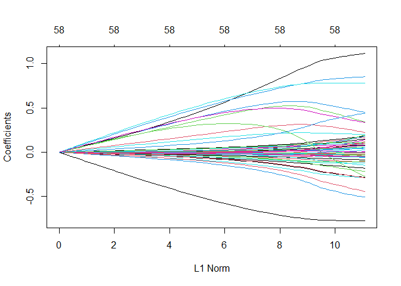
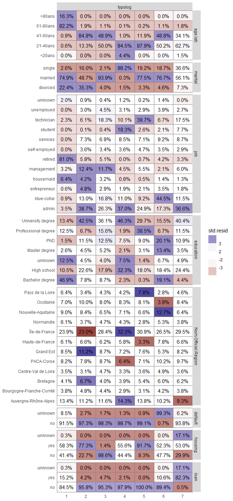

Modélisation de la probabilité de churn
================
Thibaut Fortuné
17/02/2022

------------------------------------------------------------------------

# 0. Import des packages

------------------------------------------------------------------------

# 1. Préparation des données

## 1.a. Importation du jeu de données de la campagne de phoning

``` r
data <- read.table("data/data_projet_2.txt", sep = "*", header = TRUE)
data <- data %>% mutate(id = row_number())
```

## 1.b. Importation de la base Iris

``` r
iris_data <- read.csv("data/georef-france-iris.csv", sep = ";", header = TRUE, fileEncoding = "UTF-8")
iris_data <- iris_data %>% 
  select(Nom.Officiel.Région, Code.Officiel.Département, Nom.Officiel.Département) %>% 
  distinct(Code.Officiel.Département, Nom.Officiel.Région, Nom.Officiel.Département)
```

### Jointure avec le jeu de la campagne de phoning

Certains codes *iris* n’etaient pas reconnus pour la jointure et me
donnait alors 308 NAs. J’ai alors recréé le code département avec les
deux premiers caractères de la colonne *iris* et ainsi faire la jointure
dessus.

``` r
data <- data %>% mutate(code.dept = substr(iris, start = 1, stop = 2))
data <- data %>% left_join(unique(iris_data), by = c("code.dept" = "Code.Officiel.Département"))
summary(data)
```

    ##      iris               age                Job              marital         
    ##  Length:41188       Length:41188       Length:41188       Length:41188      
    ##  Class :character   Class :character   Class :character   Class :character  
    ##  Mode  :character   Mode  :character   Mode  :character   Mode  :character  
    ##                                                                             
    ##                                                                             
    ##                                                                             
    ##                                                                             
    ##   Education           default            housing              loan          
    ##  Length:41188       Length:41188       Length:41188       Length:41188      
    ##  Class :character   Class :character   Class :character   Class :character  
    ##  Mode  :character   Mode  :character   Mode  :character   Mode  :character  
    ##                                                                             
    ##                                                                             
    ##                                                                             
    ##                                                                             
    ##    contact             month           day.of.week           duration     
    ##  Length:41188       Length:41188       Length:41188       Min.   :   0.0  
    ##  Class :character   Class :character   Class :character   1st Qu.: 103.0  
    ##  Mode  :character   Mode  :character   Mode  :character   Median : 180.0  
    ##                                                           Mean   : 258.8  
    ##                                                           3rd Qu.: 320.0  
    ##                                                           Max.   :4918.0  
    ##                                                           NA's   :5000    
    ##     Campaign          pdays          Previous       poutcome        
    ##  Min.   : 1.000   Min.   :  0.0   Min.   :0.000   Length:41188      
    ##  1st Qu.: 1.000   1st Qu.:999.0   1st Qu.:0.000   Class :character  
    ##  Median : 2.000   Median :999.0   Median :0.000   Mode  :character  
    ##  Mean   : 2.568   Mean   :962.5   Mean   :0.173                     
    ##  3rd Qu.: 3.000   3rd Qu.:999.0   3rd Qu.:0.000                     
    ##  Max.   :56.000   Max.   :999.0   Max.   :7.000                     
    ##                                                                     
    ##   emp.var.rate      cons.price.idx  cons.conf.idx     euribor3m    
    ##  Min.   :-3.40000   Min.   :92.20   Min.   :-50.8   Min.   :0.634  
    ##  1st Qu.:-1.80000   1st Qu.:93.08   1st Qu.:-42.7   1st Qu.:1.344  
    ##  Median : 1.10000   Median :93.75   Median :-41.8   Median :4.857  
    ##  Mean   : 0.08189   Mean   :93.58   Mean   :-40.5   Mean   :3.621  
    ##  3rd Qu.: 1.40000   3rd Qu.:93.99   3rd Qu.:-36.4   3rd Qu.:4.961  
    ##  Max.   : 1.40000   Max.   :94.77   Max.   :-26.9   Max.   :5.045  
    ##                                                                    
    ##   nr.employed    subscribed        base_a_predire         id       
    ##  Min.   :4964   Length:41188       Min.   :0.0000   Min.   :    1  
    ##  1st Qu.:5099   Class :character   1st Qu.:0.0000   1st Qu.:10298  
    ##  Median :5191   Mode  :character   Median :0.0000   Median :20595  
    ##  Mean   :5167                      Mean   :0.1214   Mean   :20595  
    ##  3rd Qu.:5228                      3rd Qu.:0.0000   3rd Qu.:30891  
    ##  Max.   :5228                      Max.   :1.0000   Max.   :41188  
    ##                                                                    
    ##   code.dept         Nom.Officiel.Région Nom.Officiel.Département
    ##  Length:41188       Length:41188        Length:41188            
    ##  Class :character   Class :character    Class :character        
    ##  Mode  :character   Mode  :character    Mode  :character        
    ##                                                                 
    ##                                                                 
    ##                                                                 
    ## 

## 1.c. Préparation du jeu de données

``` r
data$Job <- as.factor(data$Job)
data$marital <- as.factor(data$marital)
data$Education <- as.factor(data$Education)
data$default <- as.factor(data$default)
data$housing <- as.factor(data$housing)
data$loan <- as.factor(data$loan)
data$contact <- as.factor(data$contact)
data$month <- as.factor(data$month)
data$day.of.week <- as.factor(data$day.of.week)
data$subscribed <- as.factor(data$subscribed)
data$poutcome <- as.factor(data$poutcome)
data$code.dept <- as.factor(data$code.dept)
data$Nom.Officiel.Département <- as.factor(data$Nom.Officiel.Département)
data$Nom.Officiel.Région <- as.factor(data$Nom.Officiel.Région)
data$age <- as.numeric(gsub("O", 0, data$age))

# summary(data)
```

### Mise en ordre des facteurs

``` r
data <- data %>%
  mutate(month = factor(month, levels = c("mar", "apr", "may", "jun", "jul", "aug", "sep", "oct", "nov", "dec")),
         default = factor(default, levels = c("no", "yes", "unknown")),
         housing = factor(housing, levels = c("no", "yes", "unknown")),
         loan = factor(loan, levels = c("no", "yes", "unknown")),
         day.of.week = factor(day.of.week, levels = c("mon", "tue", "wed", "thu", "fri")),
         poutcome = factor(poutcome, levels = c("failure", "success", "nonexistent")),
         subscribed = factor(subscribed, levels = c("no", "yes"))
  )
```

### Recodage des données

``` r
data$age.lab <- cut(data$age, c(0, 20, 40, 60, 80, 121), labels = c("<20ans", "21-40ans", "41-60ans", "61-80ans", ">80ans"))

data$duration.lab <- cut(data$duration, c(-0.5, 179.5, 359.5, 4918), labels = c("<3min", "3-6min", ">6min"))

data$campaign.lab <- cut(data$Campaign, c(0, 1.5, 5.5, 10.5, 56), labels = c("1camp", "2-5camp", "6-10camp", ">10camp"))

data$previous.lab <- cut(data$Previous, c(-0.5, 1, 7), labels = c("no", "yes"))

data$pdays.lab <- cut(data$pdays, c(-0.5, 1, 5, 10, 20, 999), labels = c("never", "1-5jours", "6-10jours", "11-20jours", ">20jours"))

data$job <- as.character(data$Job)
data$job[data$Job %in% c("admin", "admin.")] <- "admin"
data$job[data$Job %in% c("blue-collar", "blue_collar")] <- "blue-collar"
data$job[data$Job %in% c("self-employed", "self_employed")] <- "self-employed"
data$job <- as.factor(data$job)

data$education <- as.character(data$Education)
data$education[data$Education %in% c("basic.4y", "basic4y")] <- "Bachelor degree"
data$education[data$Education %in% c("basic.6y", "basic6y")] <- "Master degree"
data$education[data$Education %in% c("basic.9y", "basic9y")] <- "PhD"
data$education[data$Education %in% c("high.school", "highschool")] <- "High school"
data$education[data$Education %in% c("professional.course", "professionalcourse")] <- "Professional degree"
data$education[data$Education %in% c("university.degree", "universitydegree")] <- "University degree"
data$education <- as.factor(data$education)

data$season <- as.character(data$month)
data$season[data$month %in% c("jul", "aug", "sep")] <- "Summer"
data$season[data$month %in% c("oct", "nov", "dec")] <- "Fall"
data$season[data$month %in% c("mar")] <- "Winter"
data$season[data$month %in% c("apr", "may", "jun")] <- "Spring"
data$season <- as.factor(data$season)
```

------------------------------------------------------------------------

# 2. Explorer les données

On retire les colonnes des variables qui ne nous intéressent pas.

``` r
data_explo <- data %>% filter(base_a_predire == 0)
data_explo <- data_explo %>% select(-c(base_a_predire, id, Job, Education, Campaign, Previous, code.dept, iris))
```

``` r
var.model <- glm(subscribed~age.lab+marital+job+education+default+housing+loan+season+day.of.week+contact+previous.lab+duration.lab+pdays+poutcome+Nom.Officiel.Région, data = data_explo, family = binomial)
summary(var.model)
```

    ## 
    ## Call:
    ## glm(formula = subscribed ~ age.lab + marital + job + education + 
    ##     default + housing + loan + season + day.of.week + contact + 
    ##     previous.lab + duration.lab + pdays + poutcome + Nom.Officiel.Région, 
    ##     family = binomial, data = data_explo)
    ## 
    ## Deviance Residuals: 
    ##     Min       1Q   Median       3Q      Max  
    ## -3.3712  -0.3966  -0.2175  -0.1367   3.2108  
    ## 
    ## Coefficients: (1 not defined because of singularities)
    ##                                                 Estimate Std. Error z value
    ## (Intercept)                                   -1.750e+00  3.888e-01  -4.502
    ## age.lab21-40ans                               -4.232e-01  2.608e-01  -1.623
    ## age.lab41-60ans                               -4.382e-01  2.646e-01  -1.656
    ## age.lab61-80ans                                1.238e+00  2.913e-01   4.251
    ## age.lab>80ans                                  1.283e+00  3.726e-01   3.443
    ## maritalmarried                                 1.107e-01  6.721e-02   1.647
    ## maritalsingle                                  2.480e-01  7.463e-02   3.323
    ## maritalunknown                                 7.211e-02  4.156e-01   0.174
    ## jobblue-collar                                -3.681e-01  7.684e-02  -4.790
    ## jobentrepreneur                               -3.875e-01  1.221e-01  -3.175
    ## jobhousemaid                                  -1.109e-01  1.444e-01  -0.768
    ## jobmanagement                                 -2.006e-01  8.309e-02  -2.415
    ## jobretired                                     9.375e-02  1.154e-01   0.812
    ## jobself-employed                              -9.259e-02  1.115e-01  -0.830
    ## jobservices                                   -2.938e-01  8.285e-02  -3.546
    ## jobstudent                                     7.333e-01  1.209e-01   6.064
    ## jobtechnician                                 -1.856e-01  6.920e-02  -2.682
    ## jobunemployed                                  2.125e-01  1.253e-01   1.696
    ## jobunknown                                    -6.343e-02  2.371e-01  -0.268
    ## educationHigh school                           9.753e-02  9.201e-02   1.060
    ## educationilliterate                            1.575e+00  7.398e-01   2.129
    ## educationMaster degree                         2.508e-01  1.165e-01   2.152
    ## educationPhD                                   4.149e-03  9.372e-02   0.044
    ## educationProfessional degree                   2.130e-01  1.016e-01   2.097
    ## educationUniversity degree                     3.245e-01  9.218e-02   3.520
    ## educationunknown                               2.444e-01  1.213e-01   2.015
    ## defaultyes                                    -7.939e+00  1.131e+02  -0.070
    ## defaultunknown                                -5.809e-01  6.305e-02  -9.214
    ## housingyes                                     1.493e-02  4.050e-02   0.369
    ## housingunknown                                 8.627e-02  1.348e-01   0.640
    ## loanyes                                       -3.800e-02  5.576e-02  -0.682
    ## loanunknown                                           NA         NA      NA
    ## seasonSpring                                  -8.912e-02  6.175e-02  -1.443
    ## seasonSummer                                  -3.187e-01  6.203e-02  -5.137
    ## seasonWinter                                   1.968e+00  1.252e-01  15.714
    ## day.of.weektue                                 1.643e-01  6.373e-02   2.578
    ## day.of.weekwed                                 1.658e-01  6.356e-02   2.609
    ## day.of.weekthu                                 1.534e-01  6.234e-02   2.460
    ## day.of.weekfri                                 1.320e-01  6.544e-02   2.017
    ## contacttelephone                              -9.407e-01  5.480e-02 -17.166
    ## previous.labyes                                4.685e-01  1.120e-01   4.183
    ## duration.lab3-6min                             1.458e+00  6.143e-02  23.728
    ## duration.lab>6min                              3.205e+00  5.913e-02  54.212
    ## pdays                                         -1.678e-03  2.505e-04  -6.698
    ## poutcomesuccess                                8.471e-01  2.442e-01   3.468
    ## poutcomenonexistent                           -2.888e-02  6.596e-02  -0.438
    ## Nom.Officiel.RégionBourgogne-Franche-Comté    -1.817e-02  1.163e-01  -0.156
    ## Nom.Officiel.RégionBretagne                    1.550e-02  1.046e-01   0.148
    ## Nom.Officiel.RégionCentre-Val de Loire         1.713e-01  1.179e-01   1.453
    ## Nom.Officiel.RégionCorse                       6.701e-02  3.618e-01   0.185
    ## Nom.Officiel.RégionGrand Est                   1.136e-02  8.915e-02   0.127
    ## Nom.Officiel.RégionHauts-de-France            -6.972e-02  9.885e-02  -0.705
    ## Nom.Officiel.RégionÎle-de-France              -3.455e-02  6.753e-02  -0.512
    ## Nom.Officiel.RégionNormandie                   1.802e-01  1.126e-01   1.600
    ## Nom.Officiel.RégionNouvelle-Aquitaine         -1.249e-01  9.081e-02  -1.375
    ## Nom.Officiel.RégionOccitanie                  -2.592e-03  8.943e-02  -0.029
    ## Nom.Officiel.RégionPays de la Loire           -1.578e-01  1.067e-01  -1.480
    ## Nom.Officiel.RégionProvence-Alpes-Côte d'Azur  5.049e-02  9.108e-02   0.554
    ##                                               Pr(>|z|)    
    ## (Intercept)                                   6.74e-06 ***
    ## age.lab21-40ans                               0.104623    
    ## age.lab41-60ans                               0.097722 .  
    ## age.lab61-80ans                               2.13e-05 ***
    ## age.lab>80ans                                 0.000574 ***
    ## maritalmarried                                0.099533 .  
    ## maritalsingle                                 0.000890 ***
    ## maritalunknown                                0.862234    
    ## jobblue-collar                                1.67e-06 ***
    ## jobentrepreneur                               0.001501 ** 
    ## jobhousemaid                                  0.442380    
    ## jobmanagement                                 0.015752 *  
    ## jobretired                                    0.416699    
    ## jobself-employed                              0.406428    
    ## jobservices                                   0.000390 ***
    ## jobstudent                                    1.33e-09 ***
    ## jobtechnician                                 0.007326 ** 
    ## jobunemployed                                 0.089950 .  
    ## jobunknown                                    0.789045    
    ## educationHigh school                          0.289184    
    ## educationilliterate                           0.033248 *  
    ## educationMaster degree                        0.031358 *  
    ## educationPhD                                  0.964687    
    ## educationProfessional degree                  0.035962 *  
    ## educationUniversity degree                    0.000432 ***
    ## educationunknown                              0.043919 *  
    ## defaultyes                                    0.944060    
    ## defaultunknown                                 < 2e-16 ***
    ## housingyes                                    0.712382    
    ## housingunknown                                0.522132    
    ## loanyes                                       0.495546    
    ## loanunknown                                         NA    
    ## seasonSpring                                  0.148955    
    ## seasonSummer                                  2.79e-07 ***
    ## seasonWinter                                   < 2e-16 ***
    ## day.of.weektue                                0.009933 ** 
    ## day.of.weekwed                                0.009080 ** 
    ## day.of.weekthu                                0.013879 *  
    ## day.of.weekfri                                0.043646 *  
    ## contacttelephone                               < 2e-16 ***
    ## previous.labyes                               2.88e-05 ***
    ## duration.lab3-6min                             < 2e-16 ***
    ## duration.lab>6min                              < 2e-16 ***
    ## pdays                                         2.12e-11 ***
    ## poutcomesuccess                               0.000524 ***
    ## poutcomenonexistent                           0.661514    
    ## Nom.Officiel.RégionBourgogne-Franche-Comté    0.875857    
    ## Nom.Officiel.RégionBretagne                   0.882244    
    ## Nom.Officiel.RégionCentre-Val de Loire        0.146309    
    ## Nom.Officiel.RégionCorse                      0.853045    
    ## Nom.Officiel.RégionGrand Est                  0.898570    
    ## Nom.Officiel.RégionHauts-de-France            0.480587    
    ## Nom.Officiel.RégionÎle-de-France              0.608913    
    ## Nom.Officiel.RégionNormandie                  0.109550    
    ## Nom.Officiel.RégionNouvelle-Aquitaine         0.169072    
    ## Nom.Officiel.RégionOccitanie                  0.976877    
    ## Nom.Officiel.RégionPays de la Loire           0.138953    
    ## Nom.Officiel.RégionProvence-Alpes-Côte d'Azur 0.579343    
    ## ---
    ## Signif. codes:  0 '***' 0.001 '**' 0.01 '*' 0.05 '.' 0.1 ' ' 1
    ## 
    ## (Dispersion parameter for binomial family taken to be 1)
    ## 
    ##     Null deviance: 25595  on 36187  degrees of freedom
    ## Residual deviance: 17382  on 36131  degrees of freedom
    ## AIC: 17496
    ## 
    ## Number of Fisher Scoring iterations: 10

## 2.a. Etude de la distribution des variables catégorielles

### Distribution en fonction de l’âge

``` r
data_explo %>% 
  ggplot(aes(x=age)) +
  geom_histogram(binwidth = 1)
```

<!-- -->

Nous remarquons que nos individus sont surtout des jeunes adultes allant
de 25 à 40 ans.

### Distribution en fonction du métier

``` r
data_explo %>% 
  ggplot(aes(x=job)) +
  geom_bar() + 
  theme(axis.text.x = element_text(angle = 45))
```

<!-- -->

Nous remerquons que les métiers les plus représentés chez nos individus
sont **admin**, **blue-collar**, **technician** et **services**.

### Distribution en fonction de l’éduction

``` r
data_explo %>% 
  ggplot(aes(x=education)) +
  geom_bar() + 
  theme(axis.text.x = element_text(angle = 45))
```

<!-- -->

Les individus les plus réprésentés sont ceux qui se sont arrêtés au
diplôme d’**High school** et de **University degree**. A l’inverse les
personnes **illetrate**, avec un **Master degree** ou dont ne connais
pas le diplôme sont peu représentées. Dans le cas extrême
d’**illetrate** nous allons le combiner avec la modalité **unknown**.

``` r
data_explo$education <- fct_recode(data_explo$education, "unknown" = "illiterate")

levels(data_explo$education)
```

    ## [1] "Bachelor degree"     "High school"         "unknown"            
    ## [4] "Master degree"       "PhD"                 "Professional degree"
    ## [7] "University degree"

### Distribution en fonction de l’état matrimonial

``` r
data_explo %>% 
  ggplot(aes(x=marital)) +
  geom_bar() + 
  theme(axis.text.x = element_text(angle = 45))
```

<!-- -->

Nous remarquons que nos individus sont pour une grande partie
**married**. De plus, nous pouvons combiner les individus dont on ne
connait pas l’état civil avec les individus **single** qui ont un
facteur similaire sur la variable **subscribed** (voir le coefficient du
modèle `glm()` plus haut).

``` r
data_explo$marital <- fct_recode(data_explo$marital, "single" = "unknown")

levels(data_explo$marital)
```

    ## [1] "divorced" "married"  "single"

### Distribution en fonction de la région

``` r
data_explo %>% 
  ggplot(aes(x=Nom.Officiel.Région)) +
  geom_bar() + 
  theme(axis.text.x = element_text(angle = 45))
```

<!-- -->

On remarque que nos individus sont pour une plus grande partie issus de
l’**Ile-de-France**, alors que très peu proviennent de **Corse**. La
prospection qui a été faite est sûrement proportionnelle à la
répartition démographique du territoire français.

Afin d’éviter de nous retrouver avec des modalités peu représentées,
nous pouvons rallier la **Corse** avec sa région voisine **Provence
Alpes Côte d’Azur**.

``` r
data_explo$Nom.Officiel.Région <- fct_recode(data_explo$Nom.Officiel.Région, "PACA-Corse" = "Corse", "PACA-Corse" = "Provence-Alpes-Côte d'Azur")

levels(data_explo$Nom.Officiel.Région)
```

    ##  [1] "Auvergne-Rhône-Alpes"    "Bourgogne-Franche-Comté"
    ##  [3] "Bretagne"                "Centre-Val de Loire"    
    ##  [5] "PACA-Corse"              "Grand Est"              
    ##  [7] "Hauts-de-France"         "Île-de-France"          
    ##  [9] "Normandie"               "Nouvelle-Aquitaine"     
    ## [11] "Occitanie"               "Pays de la Loire"

### Distribution en fonction du mois de contact

``` r
data_explo %>% 
  ggplot(aes(x=month)) +
  geom_bar() + 
  theme(axis.text.x = element_text(angle = 45))
```

<!-- -->

On s’apperçoit que les campagnes de contact se déroulent se déroule
surtout au printemps, de mai jusqu’à août avec un pic en mai.

### Distribution en fonction de la saison de contact

``` r
data_explo %>% 
  ggplot(aes(x=season)) +
  geom_bar() + 
  theme(axis.text.x = element_text(angle = 45))
```

<!-- -->

Evidemment, on retrouve le même graphique que la distribution des
contact en fonction du mois. Une seule des deux suffira au modèle
prédictif, nous pourron privilégier cette variable **season** pour
simplifier les modalités au sein de la variable et donc du modèle.

### Distribution en fonction du jour de contact

``` r
data_explo %>% 
  ggplot(aes(x=day.of.week)) +
  geom_bar() + 
  theme(axis.text.x = element_text(angle = 45))
```

<!-- -->

On ne remarque pas de jour d’actvité qui sort de la normale. Les
commerciaux sont actifs tous les jours sans exception.

### Distribution en fonction du moyen de contact

``` r
data_explo %>% 
  ggplot(aes(x=contact)) +
  geom_bar() + 
  theme(axis.text.x = element_text(angle = 45))
```

<!-- -->

Pour presque le double, les individus ont été contactés sur leur
**cellular** plutôt que sur leur **telephone**.

### Distribution en fonction de crédit en défaut

``` r
data_explo %>% 
  ggplot(aes(x=default)) +
  geom_bar() + 
  theme(axis.text.x = element_text(angle = 45))
```

<!-- -->

Grâce au `summary()` fait précédemment, on se rend compte que seulement
3 de nos individus ont un crédit en défaut en paiement. Grâce au modèle
`glm()` fait plus haut nous nous appercevons que les modalités **yes**
et **unknnown** ont un facteur d’influence sur la variable
**subscribed** du même ordre de gradeur. Nous allons alors les combiner
ensemble pour simplifier le modèle.

``` r
data_explo$default <- fct_recode(data_explo$default, "unknown" = "yes")

levels(data_explo$default)
```

    ## [1] "no"      "unknown"

### Distribution en fonction de prêt au logement

``` r
data_explo %>% 
  ggplot(aes(x=housing)) +
  geom_bar() + 
  theme(axis.text.x = element_text(angle = 45))
```

<!-- -->

Cette fois-ci, nos individus ont pour le même ordre de grandeur un prêt
immobilier ou non.

### Distribution en fonction de prêt personnel

``` r
data_explo %>% 
  ggplot(aes(x=loan)) +
  geom_bar() + 
  theme(axis.text.x = element_text(angle = 45))
```

<!-- -->

Pour la majorité, nos individus n’ont pas de prêts personnels.

## 2.c. Etude bi-variée

### Etude bi-variée des variables catégorielles sociales

``` r
data_explo %>% 
  ggbivariate(outcome = "subscribed", explanatory = c("age.lab", "job", "marital", "education"))
```

<!-- -->

Nous remarquons que les adultes actifs de 21 à 60 ans sont les moins
favorables à souscrire, et pourtant comme vu précédemment, ils
représentent les catégories les plus démarchées.

Aussi, en corrélation avec **age.lab**, les personnes qui sont le plus
suceptibles de souscrire en fonction de leur **job** sont par conséquent
les étudiants et les retraités.

On remarque que l’état civil importe peu.

Et enfin d’un point de vue de l’**education**, les **University degree**
et les **unknown** ont plus de probabilité de souscrire.

### Etude bi-variée des variables catégorielles de contact

``` r
data_explo %>% 
  ggbivariate(outcome = "subscribed", explanatory = c("month", "day.of.week", "duration.lab", "contact", "previous.lab"))
```

<!-- -->

Nous pouvons remarquer que les **month** où les commerciaux prospectent
le moins, sont aussi ceux où le taux de souscription est le plus élevé.
La banque dans laquelle ils travaillent devraient alors leur demander de
se focaliser sur la qualité plutôt que sur la quantité.

Ensuite, nous remquons que le jour de contact n’a pas vraiment d’impact
sur la souscription.

En revanche, le temps de contact, lui, en a un fort. Nous remarquons que
les clients qui ont passé plus de 6 min avec un commercial ont 11 fois
plus de chance de soucrire qu’un client qui a passé moins de 3 min. Un
facteur qui reste néanmoins difficile à gérer pour le commercial qui
n’est pas maître de son interlocuteur.

Nous remarquons aussi que le contact sur le **cellular** a presque 3
fois plus de chance de convertir que le contact sur le **telephone**.

Et enfin, les individus qui ont déjà été ciblés par une campagne
précédement sont plus réceptif à une nouvelle campagne avec un taux de
souscription supérieur à 50%.

### Etude bi-variée des variables catégorielles d’endettement

``` r
data_explo %>% 
  ggbivariate(outcome = "subscribed", explanatory = c("default", "housing", "loan"))
```

<!-- -->

A première vue les varaibles d’endettement ne jouent pas vraiement en
faveur d’une souscriptionn, quelque soit le type d’endettement. Sauf,
peut-être, un léger facteur de décision au niveau de la variable
**default**.

## 2.c. Etude des composantes principales

On va créer un modèle de régression logistique pour étudier les
composantes principales.

### Création d’un modèle de regression logistique

``` r
var.model2 <- glm(subscribed~age.lab+marital+job+education+default+housing+loan+season+day.of.week+contact+previous.lab+duration.lab+pdays+poutcome+Nom.Officiel.Région, data = data_explo, family = binomial)
summary(var.model2)
```

    ## 
    ## Call:
    ## glm(formula = subscribed ~ age.lab + marital + job + education + 
    ##     default + housing + loan + season + day.of.week + contact + 
    ##     previous.lab + duration.lab + pdays + poutcome + Nom.Officiel.Région, 
    ##     family = binomial, data = data_explo)
    ## 
    ## Deviance Residuals: 
    ##     Min       1Q   Median       3Q      Max  
    ## -3.3761  -0.3965  -0.2176  -0.1369   3.2106  
    ## 
    ## Coefficients: (1 not defined because of singularities)
    ##                                              Estimate Std. Error z value
    ## (Intercept)                                -1.7538240  0.3887815  -4.511
    ## age.lab21-40ans                            -0.4205097  0.2607810  -1.613
    ## age.lab41-60ans                            -0.4356654  0.2645883  -1.647
    ## age.lab61-80ans                             1.2408207  0.2912424   4.260
    ## age.lab>80ans                               1.2835530  0.3726091   3.445
    ## maritalmarried                              0.1115256  0.0672070   1.659
    ## maritalsingle                               0.2466724  0.0745297   3.310
    ## jobblue-collar                             -0.3664963  0.0768064  -4.772
    ## jobentrepreneur                            -0.3841794  0.1219110  -3.151
    ## jobhousemaid                               -0.1101714  0.1443492  -0.763
    ## jobmanagement                              -0.2009192  0.0830853  -2.418
    ## jobretired                                  0.0956807  0.1154002   0.829
    ## jobself-employed                           -0.0887639  0.1113586  -0.797
    ## jobservices                                -0.2941962  0.0828431  -3.551
    ## jobstudent                                  0.7315876  0.1208920   6.052
    ## jobtechnician                              -0.1860129  0.0691908  -2.688
    ## jobunemployed                               0.2114724  0.1253017   1.688
    ## jobunknown                                 -0.0744182  0.2367748  -0.314
    ## educationHigh school                        0.0996940  0.0919950   1.084
    ## educationunknown                            0.2644609  0.1204869   2.195
    ## educationMaster degree                      0.2511786  0.1165144   2.156
    ## educationPhD                                0.0052677  0.0936924   0.056
    ## educationProfessional degree                0.2148289  0.1015450   2.116
    ## educationUniversity degree                  0.3262125  0.0921655   3.539
    ## defaultunknown                             -0.5796026  0.0630137  -9.198
    ## housingyes                                  0.0155878  0.0404870   0.385
    ## housingunknown                              0.0859700  0.1347725   0.638
    ## loanyes                                    -0.0375953  0.0557407  -0.674
    ## loanunknown                                        NA         NA      NA
    ## seasonSpring                               -0.0895940  0.0617370  -1.451
    ## seasonSummer                               -0.3189468  0.0620157  -5.143
    ## seasonWinter                                1.9665793  0.1252108  15.706
    ## day.of.weektue                              0.1652165  0.0637209   2.593
    ## day.of.weekwed                              0.1659270  0.0635599   2.611
    ## day.of.weekthu                              0.1547341  0.0623264   2.483
    ## day.of.weekfri                              0.1327875  0.0654289   2.029
    ## contacttelephone                           -0.9411589  0.0547907 -17.177
    ## previous.labyes                             0.4671378  0.1119868   4.171
    ## duration.lab3-6min                          1.4562732  0.0614017  23.717
    ## duration.lab>6min                           3.2043432  0.0591041  54.215
    ## pdays                                      -0.0016786  0.0002505  -6.702
    ## poutcomesuccess                             0.8475608  0.2442348   3.470
    ## poutcomenonexistent                        -0.0283381  0.0659511  -0.430
    ## Nom.Officiel.RégionBourgogne-Franche-Comté -0.0197635  0.1162811  -0.170
    ## Nom.Officiel.RégionBretagne                 0.0193219  0.1045140   0.185
    ## Nom.Officiel.RégionCentre-Val de Loire      0.1696884  0.1178945   1.439
    ## Nom.Officiel.RégionPACA-Corse               0.0506106  0.0899955   0.562
    ## Nom.Officiel.RégionGrand Est                0.0102088  0.0891552   0.115
    ## Nom.Officiel.RégionHauts-de-France         -0.0707684  0.0988408  -0.716
    ## Nom.Officiel.RégionÎle-de-France           -0.0353573  0.0675281  -0.524
    ## Nom.Officiel.RégionNormandie                0.1783982  0.1125749   1.585
    ## Nom.Officiel.RégionNouvelle-Aquitaine      -0.1251460  0.0907813  -1.379
    ## Nom.Officiel.RégionOccitanie               -0.0038209  0.0894310  -0.043
    ## Nom.Officiel.RégionPays de la Loire        -0.1593358  0.1066689  -1.494
    ##                                            Pr(>|z|)    
    ## (Intercept)                                6.45e-06 ***
    ## age.lab21-40ans                            0.106853    
    ## age.lab41-60ans                            0.099645 .  
    ## age.lab61-80ans                            2.04e-05 ***
    ## age.lab>80ans                              0.000572 ***
    ## maritalmarried                             0.097028 .  
    ## maritalsingle                              0.000934 ***
    ## jobblue-collar                             1.83e-06 ***
    ## jobentrepreneur                            0.001625 ** 
    ## jobhousemaid                               0.445327    
    ## jobmanagement                              0.015596 *  
    ## jobretired                                 0.407036    
    ## jobself-employed                           0.425393    
    ## jobservices                                0.000383 ***
    ## jobstudent                                 1.43e-09 ***
    ## jobtechnician                              0.007179 ** 
    ## jobunemployed                              0.091468 .  
    ## jobunknown                                 0.753293    
    ## educationHigh school                       0.278503    
    ## educationunknown                           0.028168 *  
    ## educationMaster degree                     0.031101 *  
    ## educationPhD                               0.955164    
    ## educationProfessional degree               0.034379 *  
    ## educationUniversity degree                 0.000401 ***
    ## defaultunknown                              < 2e-16 ***
    ## housingyes                                 0.700232    
    ## housingunknown                             0.523545    
    ## loanyes                                    0.500014    
    ## loanunknown                                      NA    
    ## seasonSpring                               0.146719    
    ## seasonSummer                               2.70e-07 ***
    ## seasonWinter                                < 2e-16 ***
    ## day.of.weektue                             0.009519 ** 
    ## day.of.weekwed                             0.009039 ** 
    ## day.of.weekthu                             0.013041 *  
    ## day.of.weekfri                             0.042408 *  
    ## contacttelephone                            < 2e-16 ***
    ## previous.labyes                            3.03e-05 ***
    ## duration.lab3-6min                          < 2e-16 ***
    ## duration.lab>6min                           < 2e-16 ***
    ## pdays                                      2.06e-11 ***
    ## poutcomesuccess                            0.000520 ***
    ## poutcomenonexistent                        0.667426    
    ## Nom.Officiel.RégionBourgogne-Franche-Comté 0.865039    
    ## Nom.Officiel.RégionBretagne                0.853328    
    ## Nom.Officiel.RégionCentre-Val de Loire     0.150059    
    ## Nom.Officiel.RégionPACA-Corse              0.573865    
    ## Nom.Officiel.RégionGrand Est               0.908837    
    ## Nom.Officiel.RégionHauts-de-France         0.474001    
    ## Nom.Officiel.RégionÎle-de-France           0.600561    
    ## Nom.Officiel.RégionNormandie               0.113033    
    ## Nom.Officiel.RégionNouvelle-Aquitaine      0.168035    
    ## Nom.Officiel.RégionOccitanie               0.965921    
    ## Nom.Officiel.RégionPays de la Loire        0.135243    
    ## ---
    ## Signif. codes:  0 '***' 0.001 '**' 0.01 '*' 0.05 '.' 0.1 ' ' 1
    ## 
    ## (Dispersion parameter for binomial family taken to be 1)
    ## 
    ##     Null deviance: 25595  on 36187  degrees of freedom
    ## Residual deviance: 17385  on 36135  degrees of freedom
    ## AIC: 17491
    ## 
    ## Number of Fisher Scoring iterations: 6

On remarque que certains groupe d’individus sont plus suceptibles de
souscrire au sein d’une même variable :

-   les **age.lab 61-80ans** & **age.lab >80ans**
-   les **job student**
-   les **season Winter**
-   les **duration.lab 3-6min** & **duration.lab >6min**
-   les **poutcome success**

## 2.d. Etude des variables économiques

Ce sont les seules variables numériques que nous avons. Nous allons
essayer de détecter une colinéarité entre-elles pour les fusionner et
ainsi rendre le futur modèle prédictif plus performant.

``` r
plot(data_explo[,12:16])
```

<!-- -->

On pourrait remarquer une corrélation :

-   entre **emp.var.rate** et **nr.employed**

-   entre **emp.var.rate** et **euribor3m**

-   entre **euribor3m** et **nr.employed**

### Réalisation d’une ACP

``` r
res <- PCAmix(data_explo[,12:16], graph = FALSE)
```

#### Détermination du nombre d’axe à retenir

``` r
round(res$eig, digit = 2)
```

    ##       Eigenvalue Proportion Cumulative
    ## dim 1       3.47      69.43      69.43
    ## dim 2       0.98      19.70      89.13
    ## dim 3       0.51      10.16      99.28
    ## dim 4       0.03       0.50      99.79
    ## dim 5       0.01       0.21     100.00

Il est intéressant d’explorer nos variables économiques sous deux
dimensions qui nous expliquerait 89.13% de nos 5 variables, sans
complexifier le graphique. Avec 3 dimensions nous pourrions expliquer
presque l’intégralité de nos variable (99.28%).

#### Représentation des variables économiques dans un sous espace de dimension 2

``` r
par(mfrow = c(1,2))
plot(res, axes = c(1, 2), choice = "cor")
plot(res, axes = c(1, 2), choice = "ind")
```

<!-- -->

En regardant le cercle de corrélation, on s’apperçoit que la variable
**cons.conf.idx** semble presque orthogonale à toutes les autres
variables, qui elles semblent toutes corrélées.

#### Test de fiabilité des variables en fonction du nombre de dimensions

``` r
round(res$quanti$cos2, digit = 3)
```

    ##                dim 1 dim 2 dim 3 dim 4 dim 5
    ## emp.var.rate   0.981 0.002 0.000 0.016 0.001
    ## cons.price.idx 0.617 0.037 0.343 0.003 0.000
    ## cons.conf.idx  0.058 0.934 0.007 0.000 0.000
    ## euribor3m      0.973 0.003 0.017 0.000 0.007
    ## nr.employed    0.842 0.009 0.140 0.007 0.002

En dimension 1 et 2, nous pourrons représenter nos variable économiques
avec une certitude proche de 100%, sauf pour la variable
**cons.price.idx** pour laquelle nous avons besoin d’une troisième
dimension.

#### Explication des variables économiques en 3 dimensions

Nous allons alors créer 3 nouvelles variables à l’aide de l’ACP et qui
remplaceront les 5 variables économiques initiales. Ainsi nous pourrons
expliquer à 99.28% nos 5 variables en simplifiant notre modèle.

``` r
pca_economic <- FactoMineR::PCA(data_explo %>% select(emp.var.rate, cons.price.idx, cons.conf.idx, euribor3m, nr.employed),
  scale.unit = TRUE, ncp = 3, graph = FALSE) # ncp = nombre de composantes à garder 

pca_new_coords <- pca_economic$ind$coord %>% as.data.frame() %>% as_tibble()

colnames(pca_new_coords) <- paste0("pca_economic_dim", 1:3)
data_opti <- data_explo %>% bind_cols(pca_new_coords)
```

``` r
summary(data_opti[,28:30])
```

    ##  pca_economic_dim1 pca_economic_dim2 pca_economic_dim3
    ##  Min.   :-3.653    Min.   :-2.3385   Min.   :-1.3887  
    ##  1st Qu.:-2.328    1st Qu.:-0.6560   1st Qu.:-0.3676  
    ##  Median : 1.295    Median :-0.2104   Median :-0.1681  
    ##  Mean   : 0.000    Mean   : 0.0000   Mean   : 0.0000  
    ##  3rd Qu.: 1.454    3rd Qu.: 0.6989   3rd Qu.: 0.3876  
    ##  Max.   : 1.880    Max.   : 3.4583   Max.   : 3.1833

------------------------------------------------------------------------

# 3. Préparation des données de prédiction

## 3.a. Réapplication des modifications à nos données d’analyse

``` r
data$education <- fct_recode(data$education, "unknown" = "illiterate")

data$marital <- fct_recode(data$marital, "single" = "unknown")

data$Nom.Officiel.Région <- fct_recode(data$Nom.Officiel.Région, "PACA-Corse" = "Corse", "PACA-Corse" = "Provence-Alpes-Côte d'Azur")

data$default <- fct_recode(data$default, "unknown" = "yes")
```

``` r
levels(data$education)
```

    ## [1] "Bachelor degree"     "High school"         "unknown"            
    ## [4] "Master degree"       "PhD"                 "Professional degree"
    ## [7] "University degree"

``` r
levels(data$marital)
```

    ## [1] "divorced" "married"  "single"

``` r
levels(data$Nom.Officiel.Département)
```

    ##  [1] "Ain"                     "Aisne"                  
    ##  [3] "Allier"                  "Alpes-de-Haute-Provence"
    ##  [5] "Alpes-Maritimes"         "Ardèche"                
    ##  [7] "Ardennes"                "Ariège"                 
    ##  [9] "Aube"                    "Aude"                   
    ## [11] "Aveyron"                 "Bas-Rhin"               
    ## [13] "Bouches-du-Rhône"        "Calvados"               
    ## [15] "Cantal"                  "Charente"               
    ## [17] "Charente-Maritime"       "Cher"                   
    ## [19] "Corrèze"                 "Corse-du-Sud"           
    ## [21] "Côte-d'Or"               "Côtes-d'Armor"          
    ## [23] "Creuse"                  "Deux-Sèvres"            
    ## [25] "Dordogne"                "Doubs"                  
    ## [27] "Drôme"                   "Essonne"                
    ## [29] "Eure"                    "Eure-et-Loir"           
    ## [31] "Finistère"               "Gard"                   
    ## [33] "Gers"                    "Gironde"                
    ## [35] "Haut-Rhin"               "Haute-Corse"            
    ## [37] "Haute-Garonne"           "Haute-Loire"            
    ## [39] "Haute-Marne"             "Haute-Saône"            
    ## [41] "Haute-Savoie"            "Haute-Vienne"           
    ## [43] "Hautes-Alpes"            "Hautes-Pyrénées"        
    ## [45] "Hauts-de-Seine"          "Hérault"                
    ## [47] "Ille-et-Vilaine"         "Indre"                  
    ## [49] "Indre-et-Loire"          "Isère"                  
    ## [51] "Jura"                    "Landes"                 
    ## [53] "Loir-et-Cher"            "Loire"                  
    ## [55] "Loire-Atlantique"        "Loiret"                 
    ## [57] "Lot"                     "Lot-et-Garonne"         
    ## [59] "Lozère"                  "Maine-et-Loire"         
    ## [61] "Manche"                  "Marne"                  
    ## [63] "Mayenne"                 "Meurthe-et-Moselle"     
    ## [65] "Meuse"                   "Morbihan"               
    ## [67] "Moselle"                 "Nièvre"                 
    ## [69] "Nord"                    "Oise"                   
    ## [71] "Orne"                    "Paris"                  
    ## [73] "Pas-de-Calais"           "Puy-de-Dôme"            
    ## [75] "Pyrénées-Atlantiques"    "Pyrénées-Orientales"    
    ## [77] "Rhône"                   "Saône-et-Loire"         
    ## [79] "Sarthe"                  "Savoie"                 
    ## [81] "Seine-et-Marne"          "Seine-Maritime"         
    ## [83] "Seine-Saint-Denis"       "Somme"                  
    ## [85] "Tarn"                    "Tarn-et-Garonne"        
    ## [87] "Territoire de Belfort"   "Val-d'Oise"             
    ## [89] "Val-de-Marne"            "Var"                    
    ## [91] "Vaucluse"                "Vendée"                 
    ## [93] "Vienne"                  "Vosges"                 
    ## [95] "Yonne"                   "Yvelines"

``` r
levels(data$default)
```

    ## [1] "no"      "unknown"

``` r
pca_economic <- FactoMineR::PCA(data %>% select(emp.var.rate, cons.price.idx, cons.conf.idx, euribor3m, nr.employed),
  scale.unit = TRUE, ncp = 3, graph = FALSE) # ncp = nombre de composantes à garder 

pca_new_coords <- pca_economic$ind$coord %>% as.data.frame() %>% as_tibble()

colnames(pca_new_coords) <- paste0("pca_economic_dim", 1:3)
data_opti <- data %>% bind_cols(pca_new_coords)
```

## 3.b. Sélection des données à garder

------------------------------------------------------------------------

# 4. Mise en place du modèle de prédiction

## 4.a. Création de la base à prédire

### Avec toutes les données

``` r
to_predict_all <- data_eco_all %>% filter(base_a_predire == 1)
to_predict_all <- to_predict_all %>% select(-base_a_predire)
summary(to_predict_all)
```

    ##        id        subscribed      age.lab         marital              job      
    ##  Min.   :36189   no  :   0   <20ans  :  18   divorced: 527   admin      :1206  
    ##  1st Qu.:37439   yes :   0   21-40ans:2914   married :3048   blue-collar:1109  
    ##  Median :38689   NA's:5000   41-60ans:1965   single  :1425   technician : 908  
    ##  Mean   :38689               61-80ans:  96                   services   : 489  
    ##  3rd Qu.:39938               >80ans  :   7                   management : 349  
    ##  Max.   :41188                                               retired    : 196  
    ##                                                              (Other)    : 743  
    ##                education              Nom.Officiel.Région    default    
    ##  Bachelor degree    : 474   Île-de-France       :1413     no     :3983  
    ##  High school        :1146   Auvergne-Rhône-Alpes: 671     unknown:1017  
    ##  unknown            : 198   Occitanie           : 418                   
    ##  Master degree      : 296   PACA-Corse          : 384                   
    ##  PhD                : 696   Grand Est           : 380                   
    ##  Professional degree: 663   Nouvelle-Aquitaine  : 366                   
    ##  University degree  :1527   (Other)             :1368                   
    ##     housing          loan           contact        season     day.of.week
    ##  no     :2249   no     :4129   cellular :3183   Fall  : 632   mon:1074   
    ##  yes    :2632   yes    : 752   telephone:1817   Spring:2661   tue: 919   
    ##  unknown: 119   unknown: 119                    Summer:1647   wed: 956   
    ##                                                 Winter:  60   thu:1072   
    ##                                                               fri: 979   
    ##                                                                          
    ##                                                                          
    ##    campaign.lab  previous.lab      pdays.lab     emp.var.rate     
    ##  1camp   :2142   no :4859     never     :   4   Min.   :-3.40000  
    ##  2-5camp :2456   yes: 141     1-5jours  :  76   1st Qu.:-1.80000  
    ##  6-10camp: 314                6-10jours :  65   Median : 1.10000  
    ##  >10camp :  88                11-20jours:  32   Mean   : 0.06108  
    ##                               >20jours  :4823   3rd Qu.: 1.40000  
    ##                                                 Max.   : 1.40000  
    ##                                                                   
    ##  cons.price.idx  cons.conf.idx      euribor3m      nr.employed  
    ##  Min.   :92.20   Min.   :-50.80   Min.   :0.634   Min.   :4964  
    ##  1st Qu.:93.08   1st Qu.:-42.70   1st Qu.:1.344   1st Qu.:5099  
    ##  Median :93.44   Median :-41.80   Median :4.857   Median :5191  
    ##  Mean   :93.57   Mean   :-40.52   Mean   :3.597   Mean   :5166  
    ##  3rd Qu.:93.99   3rd Qu.:-36.40   3rd Qu.:4.961   3rd Qu.:5228  
    ##  Max.   :94.77   Max.   :-26.90   Max.   :5.045   Max.   :5228  
    ## 

### Avec les données économiques optimisées

``` r
to_predict_opti <- data_eco_opti %>% filter(base_a_predire == 1)
to_predict_opti <- to_predict_opti %>% select(-base_a_predire)
summary(to_predict_opti)
```

    ##        id        subscribed      age.lab         marital              job      
    ##  Min.   :36189   no  :   0   <20ans  :  18   divorced: 527   admin      :1206  
    ##  1st Qu.:37439   yes :   0   21-40ans:2914   married :3048   blue-collar:1109  
    ##  Median :38689   NA's:5000   41-60ans:1965   single  :1425   technician : 908  
    ##  Mean   :38689               61-80ans:  96                   services   : 489  
    ##  3rd Qu.:39938               >80ans  :   7                   management : 349  
    ##  Max.   :41188                                               retired    : 196  
    ##                                                              (Other)    : 743  
    ##                education              Nom.Officiel.Région    default    
    ##  Bachelor degree    : 474   Île-de-France       :1413     no     :3983  
    ##  High school        :1146   Auvergne-Rhône-Alpes: 671     unknown:1017  
    ##  unknown            : 198   Occitanie           : 418                   
    ##  Master degree      : 296   PACA-Corse          : 384                   
    ##  PhD                : 696   Grand Est           : 380                   
    ##  Professional degree: 663   Nouvelle-Aquitaine  : 366                   
    ##  University degree  :1527   (Other)             :1368                   
    ##     housing          loan           contact        season     day.of.week
    ##  no     :2249   no     :4129   cellular :3183   Fall  : 632   mon:1074   
    ##  yes    :2632   yes    : 752   telephone:1817   Spring:2661   tue: 919   
    ##  unknown: 119   unknown: 119                    Summer:1647   wed: 956   
    ##                                                 Winter:  60   thu:1072   
    ##                                                               fri: 979   
    ##                                                                          
    ##                                                                          
    ##    campaign.lab  previous.lab      pdays.lab    pca_economic_dim1 
    ##  1camp   :2142   no :4859     never     :   4   Min.   :-3.64242  
    ##  2-5camp :2456   yes: 141     1-5jours  :  76   1st Qu.:-2.32839  
    ##  6-10camp: 314                6-10jours :  65   Median : 1.30162  
    ##  >10camp :  88                11-20jours:  32   Mean   :-0.02916  
    ##                               >20jours  :4823   3rd Qu.: 1.45634  
    ##                                                 Max.   : 1.88321  
    ##                                                                   
    ##  pca_economic_dim2   pca_economic_dim3 
    ##  Min.   :-2.322162   Min.   :-1.33057  
    ##  1st Qu.:-0.660841   1st Qu.:-0.36528  
    ##  Median :-0.211551   Median :-0.16499  
    ##  Mean   :-0.000127   Mean   :-0.00079  
    ##  3rd Qu.: 0.696736   3rd Qu.: 0.38583  
    ##  Max.   : 3.469494   Max.   : 3.19447  
    ## 

## 4.b. Création de la base d’entrainement

#### Avec toutes les données

``` r
to_train_all <- data_eco_all %>% filter(base_a_predire == 0)
to_train_all <- to_train_all %>% select(-base_a_predire)
summary(to_train_all)
```

    ##        id        subscribed      age.lab          marital     
    ##  Min.   :    1   no :32083   <20ans  :  122   divorced: 4085  
    ##  1st Qu.: 9048   yes: 4105   21-40ans:20714   married :21880  
    ##  Median :18095               41-60ans:14545   single  :10223  
    ##  Mean   :18095               61-80ans:  695                   
    ##  3rd Qu.:27141               >80ans  :  112                   
    ##  Max.   :36188                                                
    ##                                                               
    ##           job                     education               Nom.Officiel.Région
    ##  admin      :9216   Bachelor degree    : 3702   Île-de-France       :10210   
    ##  blue-collar:8145   High school        : 8369   Auvergne-Rhône-Alpes: 4524   
    ##  technician :5835   unknown            : 1551   Occitanie           : 3002   
    ##  services   :3480   Master degree      : 1996   Nouvelle-Aquitaine  : 2987   
    ##  management :2575   PhD                : 5349   Grand Est           : 2845   
    ##  retired    :1524   Professional degree: 4580   PACA-Corse          : 2811   
    ##  (Other)    :5413   University degree  :10641   (Other)             : 9809   
    ##     default         housing           loan            contact     
    ##  no     :28605   no     :16373   no     :29821   cellular :22961  
    ##  unknown: 7583   yes    :18944   yes    : 5496   telephone:13227  
    ##                  unknown:  871   unknown:  871                    
    ##                                                                   
    ##                                                                   
    ##                                                                   
    ##                                                                   
    ##     season      day.of.week   campaign.lab   previous.lab      pdays.lab    
    ##  Fall  : 4369   mon:7440    1camp   :15500   no :35265    never     :   37  
    ##  Spring:19058   tue:7171    2-5camp :17705   yes:  923    1-5jours  :  588  
    ##  Summer:12275   wed:7178    6-10camp: 2202                6-10jours :  541  
    ##  Winter:  486   thu:7551    >10camp :  781                11-20jours:  164  
    ##                 fri:6848                                  >20jours  :34858  
    ##                                                                             
    ##                                                                             
    ##   emp.var.rate      cons.price.idx  cons.conf.idx     euribor3m    
    ##  Min.   :-3.40000   Min.   :92.20   Min.   :-50.8   Min.   :0.634  
    ##  1st Qu.:-1.80000   1st Qu.:93.08   1st Qu.:-42.7   1st Qu.:1.344  
    ##  Median : 1.10000   Median :93.75   Median :-41.8   Median :4.857  
    ##  Mean   : 0.08476   Mean   :93.58   Mean   :-40.5   Mean   :3.625  
    ##  3rd Qu.: 1.40000   3rd Qu.:93.99   3rd Qu.:-36.4   3rd Qu.:4.961  
    ##  Max.   : 1.40000   Max.   :94.77   Max.   :-26.9   Max.   :5.045  
    ##                                                                    
    ##   nr.employed  
    ##  Min.   :4964  
    ##  1st Qu.:5099  
    ##  Median :5191  
    ##  Mean   :5167  
    ##  3rd Qu.:5228  
    ##  Max.   :5228  
    ## 

#### Avec les données économiques optimisées

``` r
to_train_opti <- data_eco_opti %>% filter(base_a_predire == 0)
to_train_opti <- to_train_opti %>% select(-base_a_predire)
summary(to_train_opti)
```

    ##        id        subscribed      age.lab          marital     
    ##  Min.   :    1   no :32083   <20ans  :  122   divorced: 4085  
    ##  1st Qu.: 9048   yes: 4105   21-40ans:20714   married :21880  
    ##  Median :18095               41-60ans:14545   single  :10223  
    ##  Mean   :18095               61-80ans:  695                   
    ##  3rd Qu.:27141               >80ans  :  112                   
    ##  Max.   :36188                                                
    ##                                                               
    ##           job                     education               Nom.Officiel.Région
    ##  admin      :9216   Bachelor degree    : 3702   Île-de-France       :10210   
    ##  blue-collar:8145   High school        : 8369   Auvergne-Rhône-Alpes: 4524   
    ##  technician :5835   unknown            : 1551   Occitanie           : 3002   
    ##  services   :3480   Master degree      : 1996   Nouvelle-Aquitaine  : 2987   
    ##  management :2575   PhD                : 5349   Grand Est           : 2845   
    ##  retired    :1524   Professional degree: 4580   PACA-Corse          : 2811   
    ##  (Other)    :5413   University degree  :10641   (Other)             : 9809   
    ##     default         housing           loan            contact     
    ##  no     :28605   no     :16373   no     :29821   cellular :22961  
    ##  unknown: 7583   yes    :18944   yes    : 5496   telephone:13227  
    ##                  unknown:  871   unknown:  871                    
    ##                                                                   
    ##                                                                   
    ##                                                                   
    ##                                                                   
    ##     season      day.of.week   campaign.lab   previous.lab      pdays.lab    
    ##  Fall  : 4369   mon:7440    1camp   :15500   no :35265    never     :   37  
    ##  Spring:19058   tue:7171    2-5camp :17705   yes:  923    1-5jours  :  588  
    ##  Summer:12275   wed:7178    6-10camp: 2202                6-10jours :  541  
    ##  Winter:  486   thu:7551    >10camp :  781                11-20jours:  164  
    ##                 fri:6848                                  >20jours  :34858  
    ##                                                                             
    ##                                                                             
    ##  pca_economic_dim1   pca_economic_dim2   pca_economic_dim3  
    ##  Min.   :-3.643026   Min.   :-2.322247   Min.   :-1.386703  
    ##  1st Qu.:-2.328386   1st Qu.:-0.660841   1st Qu.:-0.365276  
    ##  Median : 1.301616   Median :-0.213121   Median :-0.165097  
    ##  Mean   : 0.004028   Mean   : 0.000018   Mean   : 0.000109  
    ##  3rd Qu.: 1.456648   3rd Qu.: 0.696736   3rd Qu.: 0.385828  
    ##  Max.   : 1.883214   Max.   : 3.469494   Max.   : 3.194785  
    ## 

### Inspection de la distribution

Les deux bases d’entrainement ont les mêmes valeurs pour **subscribed**,
alors un seul calcul nous suffit.

``` r
table(to_train_all$subscribed) / nrow(to_train_all)
```

    ## 
    ##        no       yes 
    ## 0.8865646 0.1134354

## 4.c. Orgnaisation de la base d’entrainement avec toutes les données

### Organiser la base d’entrainement de façon aléatoire

``` r
set.seed(42)

rows <- sample(nrow(to_train_all))
to_train_all <- to_train_all[rows, ]
```

### Split de la base d’entrainement à 80%

``` r
split <- round(nrow(to_train_all) * 0.80)
train <- to_train_all[1:split, ]
test <- to_train_all[(split + 1):nrow(to_train_all), ]
```

### Inspection de la distribution

``` r
table(train$subscribed) / nrow(train)
```

    ## 
    ##       no      yes 
    ## 0.885285 0.114715

Globalement la même distribution que la base d’entrainement complète.

### Création des index d’apprentissage/test

``` r
set.seed(42)

my_folds <- createFolds(train$subscribed, k = 5)
```

### Création des contôles d’apprentissage du modèle

``` r
my_control <- trainControl(
  summaryFunction = twoClassSummary,
  classProbs = TRUE,
  verboseIter = TRUE,
  savePredictions = TRUE,
  index = my_folds
)
```

## 4.d. Création du modèle d’apprentissage en régression linéaire de toutes les données

``` r
set.seed(42)

model_glm_all <- train(
  subscribed ~ . - id,
  train,
  metric = "ROC",
  method = "glmnet",
  tuneGrid = expand.grid(
    alpha = 0:1,
    lambda = 0:10 / 10),
  trControl = my_control
)
```

    ## + Fold1: alpha=0, lambda=1 
    ## - Fold1: alpha=0, lambda=1 
    ## + Fold1: alpha=1, lambda=1 
    ## - Fold1: alpha=1, lambda=1 
    ## + Fold2: alpha=0, lambda=1 
    ## - Fold2: alpha=0, lambda=1 
    ## + Fold2: alpha=1, lambda=1 
    ## - Fold2: alpha=1, lambda=1 
    ## + Fold3: alpha=0, lambda=1 
    ## - Fold3: alpha=0, lambda=1 
    ## + Fold3: alpha=1, lambda=1 
    ## - Fold3: alpha=1, lambda=1 
    ## + Fold4: alpha=0, lambda=1 
    ## - Fold4: alpha=0, lambda=1 
    ## + Fold4: alpha=1, lambda=1 
    ## - Fold4: alpha=1, lambda=1 
    ## + Fold5: alpha=0, lambda=1 
    ## - Fold5: alpha=0, lambda=1 
    ## + Fold5: alpha=1, lambda=1 
    ## - Fold5: alpha=1, lambda=1 
    ## Aggregating results
    ## Selecting tuning parameters
    ## Fitting alpha = 1, lambda = 0 on full training set

``` r
plot(model_glm_all)
```

<!-- -->

``` r
plot(model_glm_all$finalModel)
```

<!-- -->

``` r
model_glm_all
```

    ## glmnet 
    ## 
    ## 28950 samples
    ##    20 predictor
    ##     2 classes: 'no', 'yes' 
    ## 
    ## No pre-processing
    ## Resampling: Bootstrapped (5 reps) 
    ## Summary of sample sizes: 5791, 5789, 5790, 5790, 5790 
    ## Resampling results across tuning parameters:
    ## 
    ##   alpha  lambda  ROC        Sens       Spec        
    ##   0      0.0     0.7814637  0.9851730  2.143920e-01
    ##   0      0.1     0.7811577  0.9895919  1.744190e-01
    ##   0      0.2     0.7807105  0.9925280  1.382847e-01
    ##   0      0.3     0.7804229  0.9948203  9.409544e-02
    ##   0      0.4     0.7802297  0.9969371  5.991944e-02
    ##   0      0.5     0.7800840  0.9985076  3.552978e-02
    ##   0      0.6     0.7799761  0.9992879  2.024883e-02
    ##   0      0.7     0.7798917  0.9997074  8.355345e-03
    ##   0      0.8     0.7798195  0.9999025  3.838944e-03
    ##   0      0.9     0.7797603  0.9999415  7.527286e-04
    ##   0      1.0     0.7797138  0.9999610  7.527286e-05
    ##   1      0.0     0.7834055  0.9823832  2.375031e-01
    ##   1      0.1     0.7524119  1.0000000  0.000000e+00
    ##   1      0.2     0.5000000  1.0000000  0.000000e+00
    ##   1      0.3     0.5000000  1.0000000  0.000000e+00
    ##   1      0.4     0.5000000  1.0000000  0.000000e+00
    ##   1      0.5     0.5000000  1.0000000  0.000000e+00
    ##   1      0.6     0.5000000  1.0000000  0.000000e+00
    ##   1      0.7     0.5000000  1.0000000  0.000000e+00
    ##   1      0.8     0.5000000  1.0000000  0.000000e+00
    ##   1      0.9     0.5000000  1.0000000  0.000000e+00
    ##   1      1.0     0.5000000  1.0000000  0.000000e+00
    ## 
    ## ROC was used to select the optimal model using the largest value.
    ## The final values used for the model were alpha = 1 and lambda = 0.

Pour le modèle **model_glm_all** les meilleurs hyperparamètres sont
aplha = 1 et lambda = 0.

## 4.e. Création du modèle d’apprentissage Random Forest avec toutes les données

``` r
model_rf_all <- train(
  subscribed ~ . - id,
  train,
  metric = "ROC",
  method = "ranger",
  trControl = my_control)
```

    ## + Fold1: mtry= 2, min.node.size=1, splitrule=gini 
    ## - Fold1: mtry= 2, min.node.size=1, splitrule=gini 
    ## + Fold1: mtry=31, min.node.size=1, splitrule=gini 
    ## - Fold1: mtry=31, min.node.size=1, splitrule=gini 
    ## + Fold1: mtry=60, min.node.size=1, splitrule=gini 
    ## - Fold1: mtry=60, min.node.size=1, splitrule=gini 
    ## + Fold1: mtry= 2, min.node.size=1, splitrule=extratrees 
    ## - Fold1: mtry= 2, min.node.size=1, splitrule=extratrees 
    ## + Fold1: mtry=31, min.node.size=1, splitrule=extratrees 
    ## - Fold1: mtry=31, min.node.size=1, splitrule=extratrees 
    ## + Fold1: mtry=60, min.node.size=1, splitrule=extratrees 
    ## - Fold1: mtry=60, min.node.size=1, splitrule=extratrees 
    ## + Fold2: mtry= 2, min.node.size=1, splitrule=gini 
    ## - Fold2: mtry= 2, min.node.size=1, splitrule=gini 
    ## + Fold2: mtry=31, min.node.size=1, splitrule=gini 
    ## - Fold2: mtry=31, min.node.size=1, splitrule=gini 
    ## + Fold2: mtry=60, min.node.size=1, splitrule=gini 
    ## - Fold2: mtry=60, min.node.size=1, splitrule=gini 
    ## + Fold2: mtry= 2, min.node.size=1, splitrule=extratrees 
    ## - Fold2: mtry= 2, min.node.size=1, splitrule=extratrees 
    ## + Fold2: mtry=31, min.node.size=1, splitrule=extratrees 
    ## - Fold2: mtry=31, min.node.size=1, splitrule=extratrees 
    ## + Fold2: mtry=60, min.node.size=1, splitrule=extratrees 
    ## - Fold2: mtry=60, min.node.size=1, splitrule=extratrees 
    ## + Fold3: mtry= 2, min.node.size=1, splitrule=gini 
    ## - Fold3: mtry= 2, min.node.size=1, splitrule=gini 
    ## + Fold3: mtry=31, min.node.size=1, splitrule=gini 
    ## - Fold3: mtry=31, min.node.size=1, splitrule=gini 
    ## + Fold3: mtry=60, min.node.size=1, splitrule=gini 
    ## - Fold3: mtry=60, min.node.size=1, splitrule=gini 
    ## + Fold3: mtry= 2, min.node.size=1, splitrule=extratrees 
    ## - Fold3: mtry= 2, min.node.size=1, splitrule=extratrees 
    ## + Fold3: mtry=31, min.node.size=1, splitrule=extratrees 
    ## - Fold3: mtry=31, min.node.size=1, splitrule=extratrees 
    ## + Fold3: mtry=60, min.node.size=1, splitrule=extratrees 
    ## - Fold3: mtry=60, min.node.size=1, splitrule=extratrees 
    ## + Fold4: mtry= 2, min.node.size=1, splitrule=gini 
    ## - Fold4: mtry= 2, min.node.size=1, splitrule=gini 
    ## + Fold4: mtry=31, min.node.size=1, splitrule=gini 
    ## - Fold4: mtry=31, min.node.size=1, splitrule=gini 
    ## + Fold4: mtry=60, min.node.size=1, splitrule=gini 
    ## - Fold4: mtry=60, min.node.size=1, splitrule=gini 
    ## + Fold4: mtry= 2, min.node.size=1, splitrule=extratrees 
    ## - Fold4: mtry= 2, min.node.size=1, splitrule=extratrees 
    ## + Fold4: mtry=31, min.node.size=1, splitrule=extratrees 
    ## - Fold4: mtry=31, min.node.size=1, splitrule=extratrees 
    ## + Fold4: mtry=60, min.node.size=1, splitrule=extratrees 
    ## - Fold4: mtry=60, min.node.size=1, splitrule=extratrees 
    ## + Fold5: mtry= 2, min.node.size=1, splitrule=gini 
    ## - Fold5: mtry= 2, min.node.size=1, splitrule=gini 
    ## + Fold5: mtry=31, min.node.size=1, splitrule=gini 
    ## - Fold5: mtry=31, min.node.size=1, splitrule=gini 
    ## + Fold5: mtry=60, min.node.size=1, splitrule=gini 
    ## - Fold5: mtry=60, min.node.size=1, splitrule=gini 
    ## + Fold5: mtry= 2, min.node.size=1, splitrule=extratrees 
    ## - Fold5: mtry= 2, min.node.size=1, splitrule=extratrees 
    ## + Fold5: mtry=31, min.node.size=1, splitrule=extratrees 
    ## - Fold5: mtry=31, min.node.size=1, splitrule=extratrees 
    ## + Fold5: mtry=60, min.node.size=1, splitrule=extratrees 
    ## - Fold5: mtry=60, min.node.size=1, splitrule=extratrees 
    ## Aggregating results
    ## Selecting tuning parameters
    ## Fitting mtry = 2, splitrule = gini, min.node.size = 1 on full training set

``` r
plot(model_rf_all)
```

<!-- -->

``` r
model_rf_all
```

    ## Random Forest 
    ## 
    ## 28950 samples
    ##    20 predictor
    ##     2 classes: 'no', 'yes' 
    ## 
    ## No pre-processing
    ## Resampling: Bootstrapped (5 reps) 
    ## Summary of sample sizes: 5791, 5789, 5790, 5790, 5790 
    ## Resampling results across tuning parameters:
    ## 
    ##   mtry  splitrule   ROC        Sens       Spec     
    ##    2    gini        0.7886335  0.9926646  0.1372301
    ##    2    extratrees  0.7879561  0.9943619  0.1134423
    ##   31    gini        0.7658222  0.9690097  0.2871120
    ##   31    extratrees  0.7620371  0.9683464  0.2871122
    ##   60    gini        0.7598106  0.9656346  0.2911773
    ##   60    extratrees  0.7579480  0.9659955  0.2874888
    ## 
    ## Tuning parameter 'min.node.size' was held constant at a value of 1
    ## ROC was used to select the optimal model using the largest value.
    ## The final values used for the model were mtry = 2, splitrule = gini
    ##  and min.node.size = 1.

Pour le modèle **model_rf_all** les meilleurs hyperparamètres sont mtry
= 2 avec la méthode *splitrule* gini.

## 4.f. Orgnaisation de la base d’entrainement avec les données économiques optimisées

### Organiser la base d’entrainement de façon aléatoire

``` r
set.seed(42)

rows <- sample(nrow(to_train_opti))
to_train_opti <- to_train_opti[rows, ]
```

### Split de la base d’entrainement à 80%

``` r
split <- round(nrow(to_train_opti) * 0.80)
train <- to_train_opti[1:split, ]
test <- to_train_opti[(split + 1):nrow(to_train_opti), ]
```

### Inspection de la distribution

``` r
table(train$subscribed) / nrow(train)
```

    ## 
    ##       no      yes 
    ## 0.885285 0.114715

Globalement la même distribution que la base d’entrainement complète.

### Création des index d’apprentissage/test

``` r
set.seed(42)

my_folds <- createFolds(train$subscribed, k = 5)
```

## 4.g. Création du modèle d’apprentissage en régression linéaire avec les données économiques optimisées

``` r
set.seed(42)

model_glm_opti <- train(
  subscribed ~ . - id,
  train,
  metric = "ROC",
  method = "glmnet",
  tuneGrid = expand.grid(
    alpha = 0:1,
    lambda = 0:10 / 10),
  trControl = my_control
)
```

    ## + Fold1: alpha=0, lambda=1 
    ## - Fold1: alpha=0, lambda=1 
    ## + Fold1: alpha=1, lambda=1 
    ## - Fold1: alpha=1, lambda=1 
    ## + Fold2: alpha=0, lambda=1 
    ## - Fold2: alpha=0, lambda=1 
    ## + Fold2: alpha=1, lambda=1 
    ## - Fold2: alpha=1, lambda=1 
    ## + Fold3: alpha=0, lambda=1 
    ## - Fold3: alpha=0, lambda=1 
    ## + Fold3: alpha=1, lambda=1 
    ## - Fold3: alpha=1, lambda=1 
    ## + Fold4: alpha=0, lambda=1 
    ## - Fold4: alpha=0, lambda=1 
    ## + Fold4: alpha=1, lambda=1 
    ## - Fold4: alpha=1, lambda=1 
    ## + Fold5: alpha=0, lambda=1 
    ## - Fold5: alpha=0, lambda=1 
    ## + Fold5: alpha=1, lambda=1 
    ## - Fold5: alpha=1, lambda=1 
    ## Aggregating results
    ## Selecting tuning parameters
    ## Fitting alpha = 0, lambda = 0.1 on full training set

``` r
plot(model_glm_opti)
```

<!-- -->

``` r
plot(model_glm_opti$finalModel)
```

<!-- -->

``` r
model_glm_opti
```

    ## glmnet 
    ## 
    ## 28950 samples
    ##    18 predictor
    ##     2 classes: 'no', 'yes' 
    ## 
    ## No pre-processing
    ## Resampling: Bootstrapped (5 reps) 
    ## Summary of sample sizes: 5791, 5789, 5790, 5790, 5790 
    ## Resampling results across tuning parameters:
    ## 
    ##   alpha  lambda  ROC        Sens       Spec        
    ##   0      0.0     0.7797451  0.9849097  2.176293e-01
    ##   0      0.1     0.7801077  0.9902552  1.703544e-01
    ##   0      0.2     0.7796140  0.9931913  1.317361e-01
    ##   0      0.3     0.7792256  0.9955032  8.980506e-02
    ##   0      0.4     0.7789208  0.9974736  5.660729e-02
    ##   0      0.5     0.7786764  0.9988002  3.221772e-02
    ##   0      0.6     0.7784813  0.9994147  1.859279e-02
    ##   0      0.7     0.7783269  0.9997756  7.828435e-03
    ##   0      0.8     0.7782021  0.9998829  2.559306e-03
    ##   0      0.9     0.7780945  0.9999415  6.774558e-04
    ##   0      1.0     0.7780062  0.9999707  7.527286e-05
    ##   1      0.0     0.7785505  0.9825393  2.335132e-01
    ##   1      0.1     0.5775413  1.0000000  0.000000e+00
    ##   1      0.2     0.5000000  1.0000000  0.000000e+00
    ##   1      0.3     0.5000000  1.0000000  0.000000e+00
    ##   1      0.4     0.5000000  1.0000000  0.000000e+00
    ##   1      0.5     0.5000000  1.0000000  0.000000e+00
    ##   1      0.6     0.5000000  1.0000000  0.000000e+00
    ##   1      0.7     0.5000000  1.0000000  0.000000e+00
    ##   1      0.8     0.5000000  1.0000000  0.000000e+00
    ##   1      0.9     0.5000000  1.0000000  0.000000e+00
    ##   1      1.0     0.5000000  1.0000000  0.000000e+00
    ## 
    ## ROC was used to select the optimal model using the largest value.
    ## The final values used for the model were alpha = 0 and lambda = 0.1.

Pour le modèle **model_glm_opti** les meilleurs hyperparamètres sont
aplha = 0 et lambda = 0,1.

## 4.h. Création du modèle d’apprentissage Random Forest avec les données économiques optimisées

``` r
model_rf_opti <- train(
  subscribed ~ . - id,
  train,
  metric = "ROC",
  method = "ranger",
  trControl = my_control)
```

    ## + Fold1: mtry= 2, min.node.size=1, splitrule=gini 
    ## - Fold1: mtry= 2, min.node.size=1, splitrule=gini 
    ## + Fold1: mtry=30, min.node.size=1, splitrule=gini 
    ## - Fold1: mtry=30, min.node.size=1, splitrule=gini 
    ## + Fold1: mtry=58, min.node.size=1, splitrule=gini 
    ## - Fold1: mtry=58, min.node.size=1, splitrule=gini 
    ## + Fold1: mtry= 2, min.node.size=1, splitrule=extratrees 
    ## - Fold1: mtry= 2, min.node.size=1, splitrule=extratrees 
    ## + Fold1: mtry=30, min.node.size=1, splitrule=extratrees 
    ## - Fold1: mtry=30, min.node.size=1, splitrule=extratrees 
    ## + Fold1: mtry=58, min.node.size=1, splitrule=extratrees 
    ## - Fold1: mtry=58, min.node.size=1, splitrule=extratrees 
    ## + Fold2: mtry= 2, min.node.size=1, splitrule=gini 
    ## - Fold2: mtry= 2, min.node.size=1, splitrule=gini 
    ## + Fold2: mtry=30, min.node.size=1, splitrule=gini 
    ## - Fold2: mtry=30, min.node.size=1, splitrule=gini 
    ## + Fold2: mtry=58, min.node.size=1, splitrule=gini 
    ## - Fold2: mtry=58, min.node.size=1, splitrule=gini 
    ## + Fold2: mtry= 2, min.node.size=1, splitrule=extratrees 
    ## - Fold2: mtry= 2, min.node.size=1, splitrule=extratrees 
    ## + Fold2: mtry=30, min.node.size=1, splitrule=extratrees 
    ## - Fold2: mtry=30, min.node.size=1, splitrule=extratrees 
    ## + Fold2: mtry=58, min.node.size=1, splitrule=extratrees 
    ## - Fold2: mtry=58, min.node.size=1, splitrule=extratrees 
    ## + Fold3: mtry= 2, min.node.size=1, splitrule=gini 
    ## - Fold3: mtry= 2, min.node.size=1, splitrule=gini 
    ## + Fold3: mtry=30, min.node.size=1, splitrule=gini 
    ## - Fold3: mtry=30, min.node.size=1, splitrule=gini 
    ## + Fold3: mtry=58, min.node.size=1, splitrule=gini 
    ## - Fold3: mtry=58, min.node.size=1, splitrule=gini 
    ## + Fold3: mtry= 2, min.node.size=1, splitrule=extratrees 
    ## - Fold3: mtry= 2, min.node.size=1, splitrule=extratrees 
    ## + Fold3: mtry=30, min.node.size=1, splitrule=extratrees 
    ## - Fold3: mtry=30, min.node.size=1, splitrule=extratrees 
    ## + Fold3: mtry=58, min.node.size=1, splitrule=extratrees 
    ## - Fold3: mtry=58, min.node.size=1, splitrule=extratrees 
    ## + Fold4: mtry= 2, min.node.size=1, splitrule=gini 
    ## - Fold4: mtry= 2, min.node.size=1, splitrule=gini 
    ## + Fold4: mtry=30, min.node.size=1, splitrule=gini 
    ## - Fold4: mtry=30, min.node.size=1, splitrule=gini 
    ## + Fold4: mtry=58, min.node.size=1, splitrule=gini 
    ## - Fold4: mtry=58, min.node.size=1, splitrule=gini 
    ## + Fold4: mtry= 2, min.node.size=1, splitrule=extratrees 
    ## - Fold4: mtry= 2, min.node.size=1, splitrule=extratrees 
    ## + Fold4: mtry=30, min.node.size=1, splitrule=extratrees 
    ## - Fold4: mtry=30, min.node.size=1, splitrule=extratrees 
    ## + Fold4: mtry=58, min.node.size=1, splitrule=extratrees 
    ## - Fold4: mtry=58, min.node.size=1, splitrule=extratrees 
    ## + Fold5: mtry= 2, min.node.size=1, splitrule=gini 
    ## - Fold5: mtry= 2, min.node.size=1, splitrule=gini 
    ## + Fold5: mtry=30, min.node.size=1, splitrule=gini 
    ## - Fold5: mtry=30, min.node.size=1, splitrule=gini 
    ## + Fold5: mtry=58, min.node.size=1, splitrule=gini 
    ## - Fold5: mtry=58, min.node.size=1, splitrule=gini 
    ## + Fold5: mtry= 2, min.node.size=1, splitrule=extratrees 
    ## - Fold5: mtry= 2, min.node.size=1, splitrule=extratrees 
    ## + Fold5: mtry=30, min.node.size=1, splitrule=extratrees 
    ## - Fold5: mtry=30, min.node.size=1, splitrule=extratrees 
    ## + Fold5: mtry=58, min.node.size=1, splitrule=extratrees 
    ## - Fold5: mtry=58, min.node.size=1, splitrule=extratrees 
    ## Aggregating results
    ## Selecting tuning parameters
    ## Fitting mtry = 2, splitrule = gini, min.node.size = 1 on full training set

``` r
plot(model_rf_opti)
```

<!-- -->

``` r
model_rf_opti
```

    ## Random Forest 
    ## 
    ## 28950 samples
    ##    18 predictor
    ##     2 classes: 'no', 'yes' 
    ## 
    ## No pre-processing
    ## Resampling: Bootstrapped (5 reps) 
    ## Summary of sample sizes: 5791, 5789, 5790, 5790, 5790 
    ## Resampling results across tuning parameters:
    ## 
    ##   mtry  splitrule   ROC        Sens       Spec      
    ##    2    gini        0.7886770  0.9943521  0.10817209
    ##    2    extratrees  0.7843056  0.9951422  0.09228858
    ##   30    gini        0.7669762  0.9678001  0.29230607
    ##   30    extratrees  0.7642363  0.9689219  0.28628365
    ##   58    gini        0.7629640  0.9654883  0.29539282
    ##   58    extratrees  0.7592608  0.9660736  0.28974676
    ## 
    ## Tuning parameter 'min.node.size' was held constant at a value of 1
    ## ROC was used to select the optimal model using the largest value.
    ## The final values used for the model were mtry = 2, splitrule = gini
    ##  and min.node.size = 1.

Pour le modèle **model_rf_opti** les meilleurs hyperparamètres sont mtry
= 2 avec la méthode *splitrule* gini.

------------------------------------------------------------------------

# 5. Sélection du modèle

## 5.a. Comparaison des modèles

``` r
model_list <- list(
  glmnet_all = model_glm_all,
  glmnet_opti = model_glm_opti,
  rf_all = model_rf_all,
  rf_opti = model_rf_opti
)
```

``` r
resamps <- resamples(model_list)
summary(resamps)
```

    ## 
    ## Call:
    ## summary.resamples(object = resamps)
    ## 
    ## Models: glmnet_all, glmnet_opti, rf_all, rf_opti 
    ## Number of resamples: 5 
    ## 
    ## ROC 
    ##                  Min.   1st Qu.    Median      Mean   3rd Qu.      Max. NA's
    ## glmnet_all  0.7787587 0.7824389 0.7830103 0.7834055 0.7834527 0.7893670    0
    ## glmnet_opti 0.7779175 0.7781123 0.7791800 0.7801077 0.7818868 0.7834421    0
    ## rf_all      0.7860567 0.7861638 0.7880911 0.7886335 0.7885904 0.7942655    0
    ## rf_opti     0.7864489 0.7865157 0.7888338 0.7886770 0.7895723 0.7920143    0
    ## 
    ## Sens 
    ##                  Min.   1st Qu.    Median      Mean   3rd Qu.      Max. NA's
    ## glmnet_all  0.9808321 0.9818075 0.9823440 0.9823832 0.9834179 0.9835146    0
    ## glmnet_opti 0.9888309 0.9892704 0.9896113 0.9902552 0.9908306 0.9927328    0
    ## rf_all      0.9914651 0.9916110 0.9921963 0.9926646 0.9929279 0.9951227    0
    ## rf_opti     0.9924893 0.9940984 0.9941472 0.9943521 0.9944398 0.9965859    0
    ## 
    ## Spec 
    ##                   Min.   1st Qu.    Median      Mean   3rd Qu.      Max. NA's
    ## glmnet_all  0.22393677 0.2281627 0.2423786 0.2375031 0.2461423 0.2468950    0
    ## glmnet_opti 0.15775602 0.1678585 0.1712458 0.1703544 0.1742567 0.1806549    0
    ## rf_all      0.10240964 0.1415130 0.1430184 0.1372301 0.1494166 0.1497930    0
    ## rf_opti     0.06626506 0.1098984 0.1110275 0.1081721 0.1140384 0.1396312    0

-   **ROC** : Nous pouvons nous appercevoir que le modèle qui a la ROC
    moyenne la plus haute est le modèle random forest avec les 5
    variables économiques optimisées réduites en 3 dimensions
    (**rf_opti**).

-   **Sensitivity** : Nous pouvons aussi voir que la sensibilité moyenne
    est aussi la plus haute pour le modèle **rf_opti**, 99,6% des
    individus **subscribed** qu’il va prédire seront effectivement
    **subscribed**.

-   **Specificity** : En revanche, ce moèdle **rf_opti** a la
    spécificité la plus faible, et sera plus à même de se tromper pour
    identifier un individu non **subscribed**. Néanmoins, nous pouvons
    l’ignorer puisque nous prédirons les 1000 meilleurs individus
    **subscribed** par leur probabilité.

### Choix du modèle avec la ROC moyenne la plus haute

``` r
bwplot(resamps, metric = "ROC")
```

<!-- -->

Le modèle **rf_opti** est le modèle avec la ROC moyenne la plus haute.

**Nous décidons alors de conserver le model_rf_opti pour notre
prédiction.**

## 5.b. Apprentissage du modèle **model_rf_opti** sur toutes les données d’entrainement

### Retrait de la validation croisée

``` r
my_control2 <- trainControl(
  method = "none",
  summaryFunction = twoClassSummary,
  savePredictions = TRUE,
  classProbs = TRUE,
  verboseIter = TRUE
)
```

### Mise en place des paramètres optimaux

``` r
my_grid <- expand.grid(mtry = 2, splitrule = "gini", min.node.size = 1)
```

### Entrainement du modèle final

``` r
model_final <- train(
  subscribed ~ . - id,
  to_train_opti,
  metric = "ROC",
  method = "ranger",
  tuneGrid = my_grid,
  trControl = my_control2)
```

    ## Fitting mtry = 2, splitrule = gini, min.node.size = 1 on full training set

``` r
model_final$finalModel
```

    ## Ranger result
    ## 
    ## Call:
    ##  ranger::ranger(dependent.variable.name = ".outcome", data = x,      mtry = min(param$mtry, ncol(x)), min.node.size = param$min.node.size,      splitrule = as.character(param$splitrule), write.forest = TRUE,      probability = classProbs, ...) 
    ## 
    ## Type:                             Probability estimation 
    ## Number of trees:                  500 
    ## Sample size:                      36188 
    ## Number of independent variables:  58 
    ## Mtry:                             2 
    ## Target node size:                 1 
    ## Variable importance mode:         none 
    ## Splitrule:                        gini 
    ## OOB prediction error (Brier s.):  0.08047519

------------------------------------------------------------------------

# 6. Prédiction

## 6.a. Prédiction sur les 5000 individus à contacter

``` r
data_pred <- to_predict_opti %>%
  mutate(prob_subscribed = (predict(model_final, to_predict_opti, type = "prob"))[,2])
```

## 6.b. Sélection des 1000 individus les plus favorables à **subscribed**

``` r
contact_id <- data_pred %>% 
  arrange(-prob_subscribed) %>% 
  head(1000) %>% 
  select(id, prob_subscribed)

contact_id %>% head()
```

    ##      id prob_subscribed
    ## 1 40939       0.6651384
    ## 2 40952       0.6551186
    ## 3 41077       0.6543291
    ## 4 40946       0.6516153
    ## 5 40953       0.6509144
    ## 6 40940       0.6473916

## 6.c. Export des contacts

``` r
dir.create("data/results")
```

``` r
write.csv(contact_id, "data/results/contact_export.csv", row.names = TRUE)
```

------------------------------------------------------------------------

# 7. Réalisation d’un clustering

Afin de créer un clustering de nos individus **subscribed** pour établir
des profils types de nos clients, nous allons uniquement conserver les
variables catégorielles qui les représentent. Nous retirerons alors les
variables économiques et les variables de contact, indépendantes de
l’individu.

## 7.a. Sélection des données de clustering

``` r
x.clust <- to_train_opti %>% 
  filter(subscribed == "yes")

x.clust <- x.clust[,3:10]
```

## 7.b. Calcul des distances de Gower

Nous utilisons la distance de Gower à travers nos variables
catégorielles afin de représenter nos individus **subscribed** en tenant
compte des modalité de variables même faiblement représentées.

``` r
distance_gower <- daisy(x.clust, metric = "gower")
```

## 7.c. Dendrogramme

Réalisation du dentrogramme avec la **distance_gower** au carré en
utilisation la methode de Ward D².

``` r
tree <- hclust(distance_gower, method = "ward.D2")

plot(tree, labels = FALSE)
rect.hclust(tree, k = 4, border = "green")
rect.hclust(tree, k = 5, border = "red")
```

<!-- -->

A première vue, nous remarquons 4 voire 5 grands groupe d’individus,
respectivement en vert et en rouge. Nous allons maintenant essayer de
découper le dendrogramme de façon plus précise en représentant l’inertie
inter-groupe.

## 7.d. Sélection du nombre de groupe à réaliser

### Représentation de l’inertie

``` r
inertie <- sort(tree$height, decreasing = TRUE)
plot(inertie[1:10], type = "s", xlab = "Nombre de classes", ylab = "Inertie")
points(c(2, 3, 6, 7), inertie[c(2, 3, 6, 7)], col = c("yellow3", "green3", "red3", "blue3"), cex = 2, lwd = 3)
```

<!-- -->

En représentant l’inertie, nous nous appercevons que saut les plus
grands sont pour représenter :

-   2 groupes en ***jaune***
-   3 groupes en ***vert***
-   6 groupes en ***rouge***
-   7 groupes en ***bleu***

### Analyse approfondie des facteurs de distance

``` r
as.clustrange(tree, distance_gower) %>% plot()
```

<!-- -->

-   **PBC**, **HG** & **HGSD** : qui mesurent la capacité du clustering
    à reproduire les distances, ont le meilleur taux de croissance
    jusqu’à 7 clusters.

-   **HC** : qui mesure l’écart entre la partition obtenue et la
    meilleure partition qu’il serait théoriquement possible d’obtenir,
    décroit rapidement jusqu’à 7 clusters avant de légrement remonter
    pour 8.

**Nous décidons alors de représenter nos clients types à travers 7
groupes, 7 personae différents.**

``` r
plot(tree, labels = FALSE)
rect.hclust(tree, k = 7, border = 2:7)
```

<!-- -->

## 7.e. Etude de la répartition des groupes

``` r
x.clust$typolog <- cutree(tree, 7)

freq(x.clust$typolog)
```

    ##     n    % val%
    ## 1 343  8.4  8.4
    ## 2 669 16.3 16.3
    ## 3 726 17.7 17.7
    ## 4 956 23.3 23.3
    ## 5 579 14.1 14.1
    ## 6 283  6.9  6.9
    ## 7 549 13.4 13.4

## 7.f. Decription des groupes

``` r
x.clust$typolog <- factor(x.clust$typolog)

ggtable(
  x.clust,
  columnsX = "typolog",
  columnsY = names(x.clust)[1:8],
  cells = "col.prop",
  fill = "std.resid",
  legend = 1)
```

<!-- -->

1.  **Groupe 1** : des individus agés de plus de 61 ans, majoritairement
    à la retraite, pour la plupart marriés ou divorcés, surtout diplômé
    d’un Bachelor (à comparaison avec la population d’individus).

    -   **Seniors** (8,4%)

2.  **Groupe 2** : des individus entre 40 et 60 ans plus divorcés que la
    moyenne, qui ont une carrière professionnelle qui les a conduit à
    des postes à responsabilités (**admin, management** avec une
    proportion d’**entrepreneur** sur-représentée), delaissant
    l’**Ile-de-France** pour la province (**Grand Est** et
    **Bretagne**). Il n’ont pas de défaut de paiement ni d’emprunt, mais
    ont un prêt immobilier à rembourser.

    -   **CSP+ divorcés** (16,3%)

3.  **Groupe 3** : des individus actifs, de 20 à 60 ans, mariés, plus
    diplomé que la moyenne (moins se sont arretez au lycée). Ils n’ont
    aucun crédit à rembourser.

    -   **CSP+ marriés** (17,7%)

4.  **Groupe 4** : des jeunes individus de 17 à 40 ans, célibataires,
    pour la plupart dans l’administration ou étudiant. En effet, le
    dernier diplome obtenu est sur-représenté par celui de l’**High
    school** et de l’**University**. Surtout situés en
    **Ile-de-france**, ils n’ont ni défaut de paiment, ni emprunt mais
    peuvent avoir un prêt immobilier à rembourser.

    -   **Etudiants & Jeunes actifs** (23,3%)

5.  **Groupe 5** : des individus actifs, surtout de 20 à 40 ans, pour la
    plupart mariés, qui travaillent en tant que **technician** ou
    **admin**. Il n’ont qu’un prêt immobilier à rembourser.

    -   **Employés marriés** (14,1%)

6.  **Groupe 6** : des individus actifs, marriés, qui exécutent des
    travaux physiques (**blue-collar**), sur-représentés en
    **Nouvelle-Aquitaine**. Ils n’ont pas de défaut de paiement, ni
    d’emprunt, mais ont un prêt immobilier à rembourser.

    -   **Ouvriers** (6,9%)

7.  **Groupe 7** : des individus actifs, pour la moitié mariés, qui
    travaillent dans l’administration avec un diplôme universitaire. Ils
    ont un emprunt et un prêt immobilier à rembourser.

    -   **Employés avec prêt** (13,4%)
